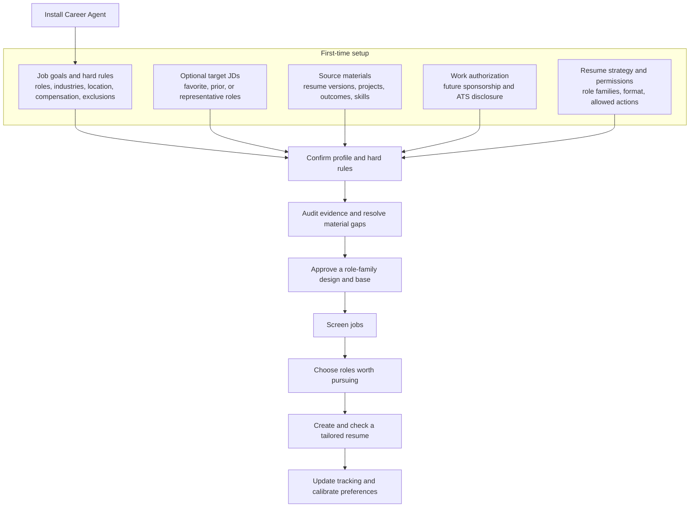
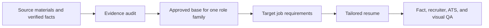

# Career Agent

Career Agent is a precision-first job-search copilot for targeted applications. It first turns your confirmed goals and evidence into a trustworthy job-search foundation, then rigorously vets high-fit roles, verifies sponsorship and official application paths, and creates truthful, efficient resume tailoring—so you apply selectively, not at volume. It is currently distributed as a Codex skill, but the workflow is platform-agnostic.

> This project is under active development. The skill never includes another user's resume, job history, work authorization, or application records.

## What it can do

Career Agent is built for rigorous, evidence-backed decisions and efficient generation: improve application quality, never maximize application count at the expense of fit or truth.

- Build a private, verified source of truth from your resume versions, supporting material, and confirmed facts.
- Guide you through job goals, hard rules, work authorization, resume preferences, and permissions before making personalized recommendations.
- Audit whether your existing resume is ready to support a role-family base—or whether more evidence is needed first.
- Search with both exact-title and LinkedIn AI-prompt approaches.
- Read job descriptions and assess role fit, sponsorship evidence, level, location, and other conditions that matter to you.
- Provide verified official application links for roles worth considering.
- Create role-specific resumes by lightly tailoring approved role-family bases and verified facts.
- Record local feedback so later searches and recommendations better reflect your preferences.

## What it will not do

- Invent your experience, skills, tenure, work authorization, or sponsorship eligibility.
- Treat a company's past H-1B activity as a guarantee that a current opening sponsors.
- Submit an application, send an external message, or change your search criteria without your in-the-moment confirmation.
- Make the final application or career decision for you.

## First-time setup

Career Agent collects the following in one guided conversation. You can update any part later.

| You provide | It helps Career Agent |
| --- | --- |
| Target roles, industries, exclusions, locations, compensation, and work style | Confirm the hard rules that govern later recommendations |
| Optional: 2–5 jobs you would genuinely consider | Learn what a good role looks like to you |
| Recent resume versions, project material, experience, outcomes, and skills | Build a verified fact library and identify evidence gaps |
| Work authorization and future sponsorship needs | Evaluate eligibility and decide whether authorization belongs on a resume or only in an ATS form |
| Career directions you want to pursue | Create the right role-family base resumes |
| Allowed actions | Know whether it may inspect pages, verify official links, update a tracker, or create drafts |



## How daily search works

Career Agent uses two search lanes, without blending them indiscriminately.

| Search lane | Best for | Purpose |
| --- | --- | --- |
| **Exact title** | You know the role names you want, such as Business Analyst | A stable, high-precision job pool |
| **LinkedIn AI prompt** | Titles vary or you want to discover adjacent work | Nonstandard titles with matching responsibilities |

### Which lane runs today?

During setup, Career Agent tests one page from each relevant lane separately and uses your feedback to create a search plan for each role family.

| Situation | Today's behavior |
| --- | --- |
| Clear title and consistently relevant results | Run exact title first; this is the default primary lane |
| Exact title produces too few viable roles after its active title search is complete | Finish all accessible pages for that title, then add AI discovery as a supplement |
| A favorite job has a title outside your title library | Use AI discovery for adjacent titles and keep exact title as a control |
| A field has inherently inconsistent titles | You may set AI discovery as primary; exact title remains a periodic quality check |
| AI discovery keeps returning unrelated jobs | Pause it and ask whether to narrow, reword, explore adjacent work, or stop |

Career Agent returns results page by page, but it does not switch to another lane after only one page. Once you choose to complete an active title or AI-prompt query, it finishes that query's accessible result pages before switching—unless you ask it to stop or recalibrate.

When both lanes run, results remain separate:

```text
1. Exact-title query → Exact-title results tables, one page at a time
2. AI-prompt query → AI discovery results tables, one page at a time
3. On request → deduplicated daily priority list
```

This makes it clear which search method found each opportunity and whether AI discovery is adding value rather than noise.

## What you receive after a search page

Career Agent reads every visible title, opens plausible full job descriptions, verifies the live official posting, and returns a page-level table:

| Company / title | Posted | Search source | Fit reason | Recommendation | Sponsorship evidence | Official application link |
| --- | --- | --- | --- | --- | --- | --- |
| Example Co. / Role | Posting age or date | Exact title or AI discovery | Why it fits or fails | APPLY NOW, HOLD, or another explicit action | Evidence and judgment | Direct official link |

A role is marked **APPLY NOW** only when Career Agent verifies a live official posting and direct application path. You can explicitly request a multi-page batch; it will still verify each recommended link and return a deduplicated summary.

## How sponsorship is assessed

Career Agent separates evidence from judgment:

- **Direct support / direct refusal:** the current job description or an official current employer policy explicitly supports or refuses sponsorship.
- **Positive historical signal:** the current role is silent, but the matched employer entity has verifiable prior H-1B activity. This can raise priority, but still requires confirmation.
- **Unclear:** there is no current direct evidence and no reliable historical signal.

If future sponsorship matters to you, historical data influences prioritization; it never replaces a current answer.

## How resume tailoring works

Every tailored resume starts from truthful evidence and an approved base, not a blank rewrite.



Before drafting, Career Agent maps job requirements to verified facts. It will not build a base from a thin or generic source resume: it first asks targeted questions about the problem, ownership, deliverable, and result behind material claims. After drafting, it runs independent factual, recruiter-readability, ATS, and visual checks. If the job has a material fit, sponsorship, or evidence gap, it tells you rather than forcing a resume for it.

### Resume quality standards

A resume is not application-ready until every applicable check passes:

| Standard | What Career Agent requires |
| --- | --- |
| Evidence first | Every JD term, skill, metric, and outcome maps to a verified fact or is recorded as a gap |
| One clear identity | The summary and top evidence communicate one role-family story, not a generic list of tools |
| Accomplishment evidence | Priority bullets show ownership, a concrete deliverable or decision, and credible consequence or scale where verified |
| Honest tailoring | Keywords are used naturally only when supported; no invented experience, tenure, certification, domain knowledge, or result |
| Recruiter and ATS readability | Standard readable structure, skimmable evidence, rendered visual check, and text-extraction check |

Career Agent preserves the user's approved base format and changes only what improves truthful fit: typically the summary, skills emphasis, and a small number of relevant bullets. It labels incomplete work as **DRAFT — NOT APPLICATION-READY** rather than treating an ATS-style score as a substitute for these gates.

## Feedback that improves later results

Career Agent asks for feedback only when it can improve the next step, for example:

- “Was this lane too broad, too narrow, or misaligned?”
- “Would you consider any of these nonstandard titles?”
- “Does this role-family base accurately represent your professional identity and facts?”

Feedback improves your local search plan by default. You may opt in to share a de-identified quality summary for future skill improvements; your resume text, contact details, and application records are never shared automatically.

## Privacy

Your job-search files and records stay in your own local workspace. The public skill should not contain or upload private application materials.
